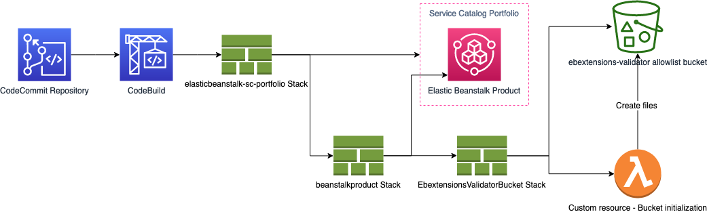
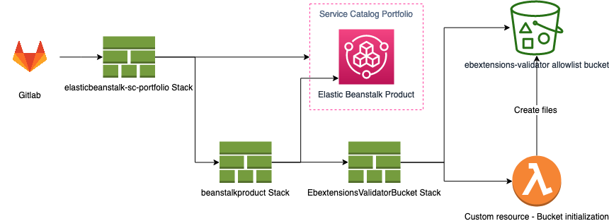

# CICD

  - [AWS Codebuild](#aws-codebuild)
  - [GitLab](#gitlab)
  - [CloudFormation Stacks](#cloudformation-stacks)

If you want to use CICD pipeline instead of the direct installation via the "Launch Stack" button, you can use one of the following options.  
**Note**: The architecture diagrams here do *not* describe the usage of the solution, but only the deployment of the Service Catalog Portfolio, which is used to deploy the actual solution.

## AWS Codebuild

The `buildspec.yml` file contains the configurations for a CodeBuild deployment.  
This configuration file expects following environment variables:  
| Environment Variable Name | Description                                                               |
|---------------------------|---------------------------------------------------------------------------|
| ARTIFACT_BUCKET_NAME      | S3 bucket name used by the pipeline to store the CloudFormation templates |
| STACKNAME                 | Name of the CloudFormation Stack to be deployed                           |

### Deployment

**Duration - 20-30 Minutes**

To use this option, perform the following steps:  
1.) Deploy the CloudFormation template `codepipeline.yaml`. This will deploy a AWS CodePipeline with an empty AWS CodeCommit repository and an AWS CodeBuild project.  
2.) Upload this repository including all of the the folder to the newly created CodeCommit repository. Make sure that the branch name matches the branch name specified in step 1!  
3.) Go to the newely created CodePipeline and release the changes.

The CodeBuild project will pickup the `buildspec.yml` and will finally deploy the Service Catalog portfolio.  
After deployment, you can use the Service Catalog portfolio to provision the Elastic Beanstalk product.

### Architecture Diagram

## GitLab

The `.gitlab-ci.yml` file contains the configurations for a GitLab CICD pipeline.  
This configuration file expects following environment variables:  
| Environment Variable Name   | Description                                                               |
|-----------------------------|---------------------------------------------------------------------------|
| ARTIFACT_BUCKET_NAME_PREFIX | S3 bucket name used by the pipeline to store the CloudFormation templates |
| AWS_ACCESS_KEY_ID           | AWS Access Key ID of an IAM User with permissions to deploy the solution  |
| AWS_SECRET_ACCESS_KEY       | AWS Secret Key of an IAM User with permissions to deploy the solution     |
| AWS_DEFAULT_REGION          | Target AWS Region to deploy the solution                                  |
| STACKNAME                   | Name of the CloudFormation Stack to be deployed                           |

See the GitLab documentation for further instructions: https://docs.gitlab.com/ee/ci/README.html

### Permissions needed by IAM User
* AWS CloudFormation	
* Amazon S3	
* AWS Security Token Service	
* AWS Elastic Beanstalk	
* AWS Service Catalog	
* AWS Identity and Access Management	
* AWS Lambda	
* AWS Key Management Service

### Architecture Diagram

## CloudFormation Stacks

Both deployment options deploy a CloudFormation stack, which again deploys two nested stacks in total as seen in the architecutre diagrams above. This section describes the stacks on a high level:

| Stack name                    | Resources                                                           |
|-------------------------------|---------------------------------------------------------------------|
| elasticbeanstalk-sc-portfolio | <ul><li>Service Catalog Portfolio - Product will be added in *beanstalkproduct* stack</li><li> IAM Role - Launch Role for the Service Catalog Portfolio</li><li> Nested stack - *beanstalkproduct* stack</li></ul>
| beanstalkproduct              | <ul><li>Service Catalog Product - providing the Elastic Beanstalk solution described in [sc-elasticbeanstalk](../sc-elasticbeanstalk) and associating it with the portfolio deployed in *elasticbeanstalk-sc-portfolio* stack</li><li>Nested stack - *EbextensionsValidatorBucket* stack</li></ul> |
| EbextensionsValidatorBucket   | S3 bucket - *ebextensions-validator-allowlist* bucket described in [allowlist-bucket](../allowlist-bucket) |
