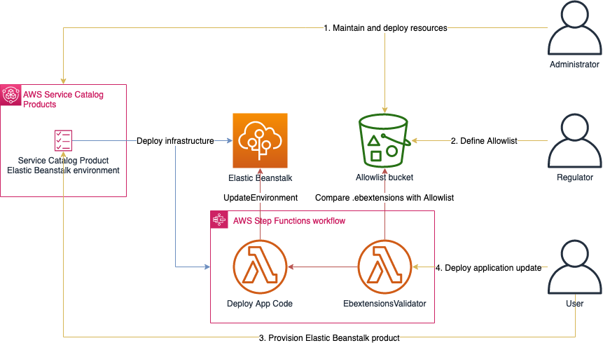

# Regulated application deployment workflow for AWS Elastic Beanstalk via AWS Service Catalog and AWS Step Functions

The solution provides regulated provisioning of AWS Elastic Beanstalk environments. It also provides workflow for deploying and updating the application code into an Elastic Beanstalk environment while ensuring that the environment keeps its predefined configurations.

The main features of this solution are:  

* Regulated deployment of Elastic Beanstalk environments via AWS Service Catalog 
* Control over the update process of the Elastic Beanstalk environment via AWS Step Functions
* Mechanism for validating .ebextensions configuration files during an application deployment via regular expressions

# Table of Content

- [Documentations](#documentations)
- [Architecture Overview](#architecture-overview)
  - [Features](#features)
  - [Actors](#actors)
- [Install](#install)
  - [What's next?](#whats-next)
- [Repository Overview](#repository-overview)
- [Further steps on security hardening of the solution](#further-steps-on-security-hardening-of-the-solution)
- [Warning](#warning)
- [License](#license)

# Documentations
This page gives a high level overview of this solution. Please find further documentation here:

| Name                     | Description                                                                                                        |
|--------------------------|--------------------------------------------------------------------------------------------------------------------|
| [allowlist-bucket](allowlist-bucket)         | Deployment of the allowlist-bucket for validating ebextensions                                           |
| [CICD](CICD)                     | Deployment of the solution via a CICD pipeline. This is needed if modifications need to be done to the product.    |
| [docs](docs)                    | Explanation how this solution is used by the Administrator, Regulator and User                                     |
| [ebextensions-validator](ebextensions-validator)   | Usage of the ebextensions-validator Python tool and detailed description of how allowlisting of ebextensions work. |
| [sc-elasticbeanstalk](sc-elasticbeanstalk)      | Description about the Elastic Beanstalk product deployed via Service Catalog - the core of this solution.          |
| [sc-elasticbeanstalk/application_deployment](sc-elasticbeanstalk/application_deployment)| Details about the State Machine used to deploy and update applications on a running Elastic Beanstalk environment. |
| [SCP](SCP)                      | Explanation of an example SCP which ensures that the deployed resources are not modified by the user.              |

# Architecture Overview

Following architecture describes a high-level overview of the resources being deployed by this solution:  



## Features
* Offers Elastic Beanstalk as a Service Catalog Product
* Standarizes the initial configuration of Elastic Beanstalk environment via Service Catalog
* Centralizes control over the update process of the Elastic Beanstalk environment using Step Functions
* Controls configurations set by the user via .ebextensions during an application deployment in the Step Functions workflow 


### Service Catalog Product 

The Service Catalog Product deploys:

* AWS Elastic Beanstalk Environment
* AWS Step Functions
    * Used to perform `UpdateEnvironment` calls to deploy and update application code on the Elastic Beanstalk Environment
    * Containing a Lambda function which validates the application code against an allow list before performing the deployment of the code

### S3 bucket

S3 bucket contains the allowlist files used by the `EbextensionsValidator` Lambda function to validate the application code before deploying the application.

## Actors

Following are the actors involved into the operation of this solution. More details on how the individual roles use the solution can be found in [docs](docs).

### Administrator

The Administrator’s responsibility is the maintainance and deployment of the AWS Service Catalog Portfolio/Products and the Allowlist S3 bucket. It provides this infrastructure for the Regulator and User to consume and use. 
The Administrator’s role is usually fulfilled by the CloudTeam.

### Regulator

The Regulator’s responsibility is to define the Allowlists deployed in the S3 bucket. This is based on compliance and security considerations to control the actions which are allowed to be performed on the Elastic Beanstalk environments.  
The CloudFormation template which defines the AWS Service Catalog Product itself should be created and maintained in consultation with the Regulator, since the AWS Service Catalog Product serves as a preventative control.  
The Regulator’s role can be fullfilled by the security department for example.

### User
 User’s task is to consume the AWS Service Catalog product provided by the CloudTeam. It vends the product via AWS Service Catalog and uses AWS Service Catalog to update the provisioned products in case a new version was published by the Cloudteam.  
The User is not supposed to interact directly with the Elastic Beanstalk environment but to use the StateMachine realized by AWS Step Functions to deploy and update the application code on the Elastic Beanstalk Environment.  
The User’s role is usually fullfilled by developers of an application or product team.

# Install
Launch the Elastic Beanstalk portfolio stack:  

[](https://console.aws.amazon.com/cloudformation/home?region=eu-central-1#/stacks/new?stackName=SC-Beanstalk-with-ebextensions-validator&templateURL=https://public-artifacts-eu-central-1-907413805921.s3.amazonaws.com/sc-portfolio-elasticbeanstalk.yaml)

This cloudformation stack will deploy
* [`cf-ebextensions-validator-allowlist-<accountid>` bucket](allowlist-bucket)
* Service Catalog Portfolio containing following Service Catalog Product
  * [sc-elasticbeanstalk](sc-elasticbeanstalk)

Note: The "Launch Stack" button is not working, since the specified artifact bucket is not public. If you want to run this solution in your own account, use the options described in [CICD](CICD)! TODO - Fix this for public release!

This process deploys the solution in a single account. If the solution should be distributed across multiple accounts, further infrastructure is needed. [Service Catalog Tools](https://service-catalog-tools-workshop.com/tools.html) could assist in this case.

## What's next?
Follow the descriptions in [docs](docs) about how to use the solution.

# Repository Overview

This section describes the different components of this repository. You find more information on each of these components in more detail in the `README.md` files in the individual folders.

```
.
├── CICD
│   ├── README.md
│   ├── buildspec.yml
│   └── codepipeline.yaml
├── LICENSE
├── README.md
├── SCP
│   ├── SCP.json
│   └── README.md
├── allowlist-bucket
│   ├── README.md
│   ├── allowlist-bucket.yaml
│   └── ebextensionsValidatorInitialization
├── docs
│   └── README.md
├── ebextensions-validator
│   ├── LICENSE.txt
│   ├── README.md
│   ├── ebextensions_validator
│   ├── requirements.txt
│   ├── setup.py
│   ├── test_files
│   └── tests
├── img
│   ├── Beanstalk-sc-Architecture.png
│   ├── CodeBuildPipeline.png
│   ├── GitlabPipeline.png
│   └── StateMachine.png
├── sc-elasticbeanstalk
│   ├── README.md
│   ├── application_deployment
│   ├── beanstalk.README.md
│   ├── ec2KeyPairDummy
│   ├── out.README.md
│   ├── out.yaml
│   ├── sc-elasticbeanstalk-ra.yaml
│   └── update_solution_stack_list.sh
├── sc-portfolio-elasticbeanstalk.yaml
└── sc-product-elasticbeanstalk.yaml
```

| Name                               | Description                                                                                                                                                                                                                                                                               |
|------------------------------------|-------------------------------------------------------------------------------------------------------------------------------------------------------------------------------------------------------------------------------------------------------------------------------------------|
| [CICD](CICD)                               | This folder contains two options to deploy the solution via a CICD pipeline                                                                                                                                                                                                               |
| [SCP](SCP)                               | This folder contains an example SCP to prevent the User from interacting with Elastic Beanstalk directly and to protect the resources deployed by this solution from unauthorized changes |
| [allowlist-bucket](allowlist-bucket)                   | This folder contains the CloudFormation template to deploy the  ebextensions-validator-allowlist S3 bucket. It also contains deployment instructions and information about the ebextensions-validator.                                                                                    |
| [docs](docs)                               | This folder contains a documentation about how the individual roles (Administrator, Regulator, User) are supposed to use the solution |
| [ebextensions-validator](ebextensions-validator)             |  This folder contains the ***ebextensions-validator* Python library** including documentation and unit tests. The library is used in the *EbextensionsValidator* task in the StateMachine describe in [sc-elasticbeanstalk/application_deployment](sc-elasticbeanstalk/application_deployment). |
| [img](img)                                | This folder contains images used in the READMEs.                                                                                                                                                                                                                                          |
| [sc-elasticbeanstalk](sc-elasticbeanstalk)                | This folder contains the AWS Elastic Beanstalk resources and StateMachine to deploy and update application code. It is the core of this repository.                                                                                                                                       |
| [sc-portfolio-elasticbeanstalk.yaml](sc-portfolio-elasticbeanstalk.yaml) | This CloudFormation template creates a Service Catalog Portfolio containing the Service Catalog Elastic Beanstalk Product. The product itself is defined in the `sc-product-elasticbeanstalk.yaml` template. It also creates an IAM Role which is used by Service Catalog as a Launch Role. |
| [sc-product-elasticbeanstalk.yaml](sc-product-elasticbeanstalk.yaml)   | This CloudFormation template creates the Service Catalog Product which can be used to provision an Elastic Beanstalk environment as described above. It also deploys the ebextensions-validator-allowlist bucket defined in [allowlist-bucket](allowlist-bucket).                                                    |

#  Further steps on security hardening of the solution

* Lockdown AWS Systems Manager (SSM) : Elastic Beanstalk Instances have the SSM agent running by default. This makes it possible to execute commands on the Elastic Beanstalk instance by using SSM. To prevent this scenario ensure that SSM agents are disabled in AMI used for Elastic Beanstalk  
* Define AWS Config rules if your organization needs to ensure compliancy within the Elastic Beanstalk configurations after deployment time.

# Warning
* Before you distribute the CloudFormation template to your organization, review the template. 
Check IAM permissions, Deletion policies, update stack behavior, other aspects of the template, 
and ensure that they are as per your expectations and processes. 
* These sample CloudFormation templates may need updates before you can use them in production.  
* Running these templates may result in charges to your AWS account.  
* Provisioning the supplied Products through ServiceCatalog will create AWS Services which will be billed to your account.

## Security

See [CONTRIBUTING](CONTRIBUTING.md#security-issue-notifications) for more information.

## License

This project is licensed under the Apache-2.0 License.

