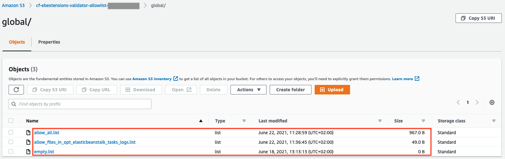

# allowlist-bucket

This folder contains the CloudFormation template to deploy the *ebextensions-validator-allowlist* S3 bucket. It also contains deployment instructions and information about the ebextensions-validator.

## Installation

These steps are not needed if you use the instructions in the "Install" section [here](/README.md) or one of the CICD options in [CICD](../CICD).

### 1.) Set Artefact Bucket (if not already existent)

Create an artefact bucket which is accessible from the target account where the Elastic Beanstalk environment shall be deployed.

### 2.) Package template

```
aws cloudformation package --template-file allowlist-bucket.yaml --output-template-file out-allowlist-bucket.yaml --s3-bucket ${artefactbucket}
```

### 2.) Deploy template

Deploy the output-template `out-allowlist-bucket.yaml`. You need to specify two parameters:

* AllowRoleArn
    * This is the IAM Role ARN, which shall be allowed to assume the `CF-ebextensions-validator` IAM Role. This role is allowed to modify the content of the ebextensions-validator-allowlist bucket.
    * You can edit the bucket policy after deployment, if you want to allow other principals to edit the content of the bucket.
* GlobalAllowlistBucketPrefix
    * This is the bucket name prefix used for ebextensions-validator s3 bucket
    * Default: “cf-ebextensions-validator-allowlist”
    * It is important that this parameter matches the parameter with the same name in the [sc-elasticbeanstalk-ra.yaml](../sc-elasticbeanstalk/sc-elasticbeanstalk-ra.yaml) template as both, the **Default** and **AllowedValue**.
* GlobalAllowlistFolderName
    * This is the folder name used for globally defined allow lists.
    * Default: “global”
    * It is important that this parameter matches the parameter with the same name in the [sc-elasticbeanstalk-ra.yaml](../sc-elasticbeanstalk/sc-elasticbeanstalk-ra.yaml) template as both, the **Default** and **AllowedValue**.

## Usage

For each provisioned product, a dedicated allowlist can be defined in the S3 bucket with the key name `<provisioned-product-id>/allow.list`. If no dedicated allowlist is provided, the global allowlist defined in `global/allow.list` is considered by `ebextensions-validator`. If no `allow.list` is found at all, the step in the state machine fails with an exception.  
Per default, there is no `allow.list` in the S3 bucket, which means that any deployment of applications containing an `.ebextension` or `.env` is denied by the state machine.

For more information how to use the Ebextensions-Validator, see in [docs#Regulator](../docs#regulator).  

As a starting point, some example files are created in the S3 bucket:


### allow_all.list
This allowlist allows any valid `.ebextensions` configuration or `.env` file:
```
option_settings:
  .*
packages:
  .*
groups:
  .*
users:
  .*
sources:
  .*
files:
  .*
commands:
  .*
services:
  sysvinit:
    .*
container_commands:
  .*
Resources:
  .*
Outputs:
  .*
```

### allow_files_in_opt_elasticbeanstalk_tasks_logs.list
This allowlist allows the `.ebextensions` configuration files to store files into the specified directories via regular expressions:
```
files:
  /opt/elasticbeanstalk/tasks/.*logs.d/.*
```

### empty.list
This is just an empty file. If you specify this file as the allowlist, the deployment of a new application version will always fail if an `.ebextensions` directory or `.env` file is present in the root of the application archive.
