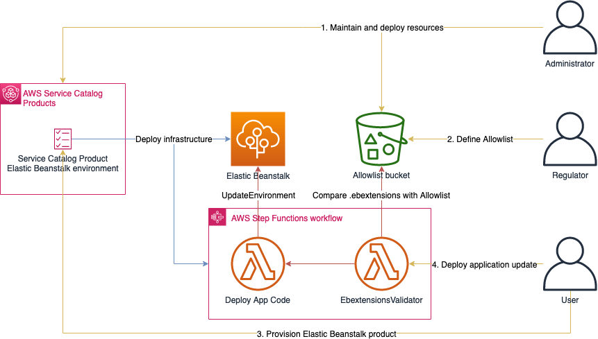
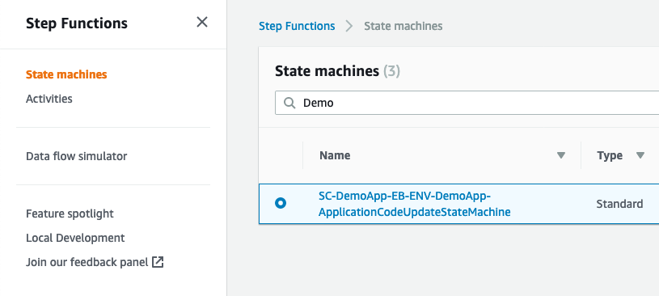
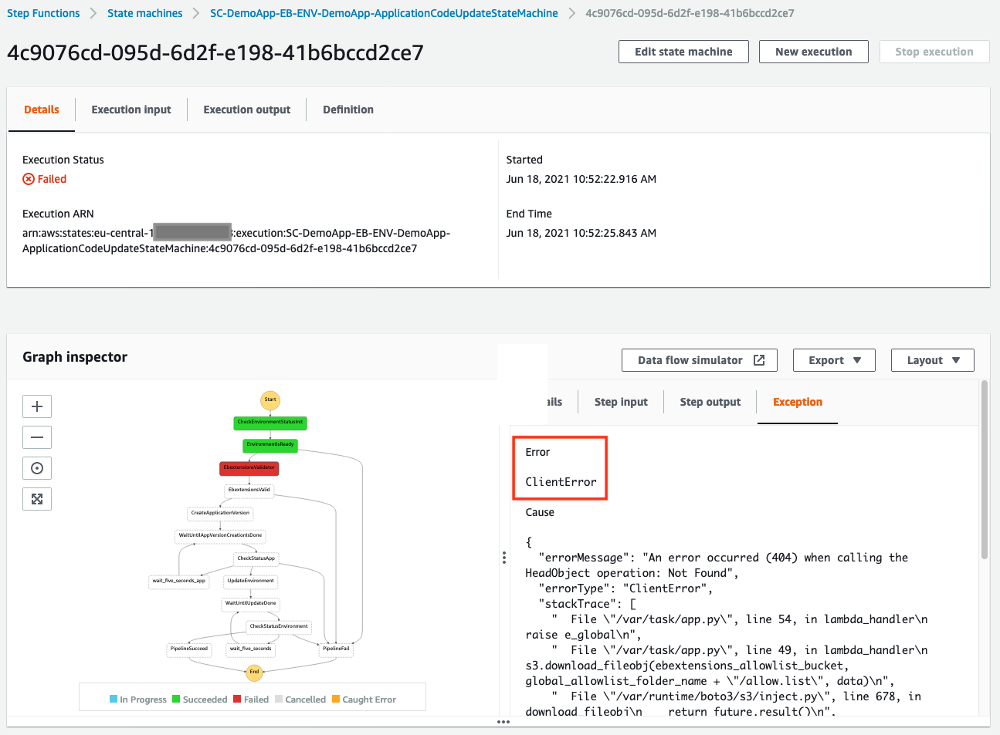

# Usage

This page explains how the three roles, Administrator, Regulator and User, are supposed to use the solution

**Note: Before you can provision an Elastic Beanstalk environment with this solution as a User, the Administrator needs to share the portfolio with the User. See [Share Service Catalog Portfolio with User](#share-service-catalog-portfolio-with-user)!**

- [Administrator](#administrator)
  - [Deployment](#deployment)
  - [Share Service Catalog Portfolio with User](#share-service-catalog-portfolio-with-user)
  - [Maintenance](#maintenance)
- [User](#user)
  - [Requirements](#requirements)
  - [Provisioning of Elastic Beanstalk Environment](#provisioning-of-elastic-beanstalk-environment)
  - [Deploying applications via the Step Function](#deploying-applications-via-the-step-function)
- [Regulator](#regulator)
- [End to end workflow](#end-to-end-workflow)




## Administrator

The Administrator's job is deploy and maintain the solution.

### Deployment

The quickest way to deploy the solution is to use the "Launch Stack" button in the "Install" section [here](/README.md).
Further deployment options, which also allow customization of the solution, are described in the [CICD](../CICD) section of this repository.  
If this solution should be distributed across multiple accounts, further infrastructure is needed. [Service Catalog Tools](https://service-catalog-tools-workshop.com/tools.html) could assist in this case.

### Share Service Catalog Portfolio with User

To allow the User to provision the Service Catalog product, the User's IAM principal (IAM User/Group/Role) needs to be associated with the Service Catalog Portfolio. See https://docs.aws.amazon.com/servicecatalog/latest/adminguide/catalogs_portfolios_users.html.

### Maintenance

The `update_solution_stack_list.sh` script in [sc-elasticbeanstalk](../sc-elasticbeanstalk) keeps the list of available solution stacks in the Service Catalog product up to date. There is no active maintenance of this solution needed, unless further requirements exist.

Depending on the requirements some customization may need to be performed to this solution. The following table shows the parts of this solution which may need to be customized:

| Name                    | Location                    | Description                                                                                                                                                        | Reason to customize                                                                                                               |
|-------------------------|-----------------------------|--------------------------------------------------------------------------------------------------------------------------------------------------------------------|-----------------------------------------------------------------------------------------------------------------------------------|
| Service Catalog Product | [sc-elasticbeanstalk-ra.yaml](../sc-elasticbeanstalk/sc-elasticbeanstalk-ra.yaml) | The CloudFormation template defines the default configurations of the Elastic Beanstalk environment and the parameters which can be set by the User.               | <ul><li>Change parameters to be set by Users</li><li>Change default AWS Elastic Beanstalk configuration</li></ul>                                       |
| Step Function           | [application_deployment](../sc-elasticbeanstalk/application_deployment)      | The Step Function defines the wrapper used by the User to interact with the AWS Elastic Beanstalk API, e.g. to deploy an application to the Beanstalk environment. | <ul><li>Extend possibilities to interact with AWS Elastic Beanstalk API for User</li><li>Implement further controls in application deployment</li></ul> |

## User

The User's job is to use the solution. The User
* provisions the Service Catalog Product to initially deploy or subsequently update the Elastic Beanstlk Environment and
* deploys applications on the provisioned Elastic Beanstalk Environment by using the Step Function.

### Requirements

To successfully deploy an Elastic Beanstalk Environment, a proper VPC setup is required. See the AWS documentation and make sure that an appropriate VPC is present in the region, in which you are planning to deploy the solution: https://docs.aws.amazon.com/elasticbeanstalk/latest/dg/vpc.html.

### Provisioning of Elastic Beanstalk Environment

Once the User has access to the Service Catalog Portfolio (see *Share Service Catalog Portfolio with User* in the *Administrator* section), the User can see the product in Service Catalog. The AWS documentation explains how this is done in general: https://docs.aws.amazon.com/servicecatalog/latest/userguide/enduser-launch.html  
The list of parameters which can be set by the User when provisioning the product can be seen in [sc-elastcbeanstalk](../sc-elasticbeanstalk).

To update the Elastic Beanstalk environment in case the Service Catalog Product was changed by the Administrator, the User updates the provisioned Service Catalog product by following the AWS documentation: https://docs.aws.amazon.com/servicecatalog/latest/userguide/enduser-update.html

### Deploying applications via the Step Function

The AWS Step Function state machine defined in [application_deployment](../sc-elasticbeanstalk/application_deployment) should be used to deploy (or update) the application running on the Elastic Beanstalk Environment:  
* Upload the zipped version of your application code into an S3 bucket accessible by the Lambda functions in the state machine.
* Go to the state machine which is deployed together with the Elastic Beanstalk Environment. You get the Arn of the state machine from the CloudFormation or Service Catalog Provisioned Product Output.
* Invoke the state machine with the following event:

```
{
    "S3Bucket": "S3_BUCKET_NAME",
    "S3Key": "S3_KEY_OF_ZIPPED_APPLICATION_CODE",
    "DeploymentPolicy": "DEPLOYMENT_POLICY"
}
```

The `DEPLOYMENT_POLICY` string can be taken from the documentation: https://docs.aws.amazon.com/elasticbeanstalk/latest/dg/using-features.rolling-version-deploy.html.
Only `AlLAtOnce`, `Rolling` and `Immutable` are tested so far.

## Regulator

The Regulator's job is to define and maintain the allowlist used by the ebextensions-validator.  

`ebextensions-validator` is both, a Python library which validates an .ebextensions configuration file against a provided allowlist, and a step in the Application Code Deployment state machine to perform the validation before deployment. This section describes how the allowlist are managed in the `ebextensions-validator-allowlist-bucket` deployed via [allowlist-bucket](../allowlist-bucket).  
**To get more information on the Python library and how to define an allowlist, see [ebextensions-validator](../ebextensions-validator).**   

The allowlists are controlled in an S3 bucket with following properties:

* The content of the bucket is managed and controlled by a central entity (such as the security department), called "Regulator".
* The bucket is accessible with read-only permissions by the IAM Role attached to the `EbextensionsValidator` Lambda function in the state machine defined in [application_deployment](../sc-elasticbeanstalk/application_deployment).

For each provisioned product, a dedicated allowlist can be defined in the S3 bucket with the key name `<provisioned-product-id>/allow.list`. If no dedicated allowlist is provided, the global allowlist defined in `global/allow.list` is considered by `ebextensions-validator`. If no allowlist is found at all, the step in the state machine fails with an exception.

See following S3 bucket structure as an example:

```
cf-ebextensions-validator-allowlist-123456789012
├── global
│   └── allow.list
├── pp-f3d3s5rer2rtk
│   ├── allow.list
│   └── other_file_1
└── pp-m6nrgs2ojm6eg
    └── other_file_2
```

The `ebextensions-validator` in the state machine of product `pp-f3d3s5rer2rtk` does have a `allow.list` file in its directory and will use this file to validate the .ebextensions configuration files.
The `ebextensions-validator` in the state machine of product `pp-m6nrgs2ojm6eg` does not have a `allow.list` file in its directory. So it will use the global allowlist `global/allow.list` to validate the .ebextensions configuration files.
The `ebextensions-validator` in the state machine of any other product in that account does not have a dedicated folder in the bucket. So it will use the global allowlist `global/allow.list` to validate the .ebextensions configuration files.

Only dedicated IAM roles have `PutObject` and `DeleteObject` permissions on that bucket. This is controlled via the bucket policy.

## End to end workflow
This walkthrough shows how the User can provision an Elastic Beanstalk environment and deploy a new application version to it. It also shows how the Regulator can control what ebextensions are deployed by the User.
### Provision Elastic Beanstalk environment via Service Catalog

After the Administrator added the User to the Service Catalog Portfolio, the User can go to Service Catalog Products and choose the provided Elastic Beanstalk product:


After clicking the "Launch product" button, the User can specify several parameters in the product. A detailed description about all of the parameters can be found in [sc-elasticbeanstalk](../sc-elasticbeanstalk). It is important to set the following parameters: `Provisioned product name`, `ApplicationName`, `VPCId`, `EC2SubnetIds` and `ELBSubnetIds`. Make sure that the VPC and Subnets meet the requirements for Elastic Beanstalk: https://docs.aws.amazon.com/elasticbeanstalk/latest/dg/vpc.html. See the following screenshot as an example:


If the deployment is successfull, the Status should change to `Available` as seen below. The CloudFormation stack can be inspected for more details about the deployment.


At this point, Elastic Beanstalk is deployed with the sample application. You can go to the Elastic Beanstalk environment and inspect its status and open the application if you want.

### Preparation - Upload php application to S3 bucket
Before you can use the state machine to deploy a new application version, you first need to upload the application zip file to a S3 bucket in the same region, which is accessible by the Lambda functions in the state machine. A S3 bucket with default settings in the same region and account as the Elastic Benastalk environment should work fine.  
You find sample applications for the different environment platforms here: https://docs.aws.amazon.com/elasticbeanstalk/latest/dg/GettingStarted.DeployApp.html. In this guide, PHP is used.  
We download the `php.zip` application and upload it to the S3 bucket. Since the sample application contains an `.ebextensions` folder with configuration files, we call it `php_app_ebextensions`:
```
aws s3 cp php.zip s3://<bucket-name>/php_app_ebextensions.zip
```
Now, we unzip the file, remove the `.ebextensions` folder, zip it again and upload the new zip file:
```
unzip php.zip -d tmp
cd tmp
rm -rf .ebextensions
zip ../php_app_no_ebextensions.zip *
cd ..
aws s3 cp php_app_no_ebextensions.zip s3://<bucket-name>
```
We will need both files for the deployments later.

### Deploy new application version via Step Functions state machine - first try

To upload the new application version stored in S3 to the Elastic Beanstalk environment, the AWS Step Functions state machine, which is deployed together with the Elastic Beanstalk environment, is used. Go to AWS Step Functions and chose the state machine. You find it by searching for the `ApplicationName` specified in the Service Catalog product parameters:  


To start the deployment of the new application version, enter the state machine and click the "Start execution" button. Next, the User needs to enter the correct parameters as described in [Deploying applications via the Step Function](#deploying-applications-via-the-step-function). We first deploy the `php_app_no_ebextensions.zip` file:  


As seen below, the execution fails with an `ClientError`:  


The reason for that is, that the `ebextensions-validator` function cannot find an `allow.list` file. This can be seen in the CloudWatch logs of the Lambda function below. The `allow.list` file could not be found:  


To fix this, we need the help of the Regulator.

### Setup allowlist in ebextenssions-validator-allowlist bucket

The Regulator goes to the S3 bucket, deployed by the solution. Per default, the name is `cf-ebextensions-validator-allowlist-<accountid>`. There is a directory called `global`. As seen below, this directory contains two files, none of them is called `allow.list`:  


Let's first rename the `empty.list` to `allow.list`:  


According to [ebextensions-validator#empty-file](../ebextensions-validator#empty-file), this file should block any `.ebextensions` deployments. This will be tested in the next steps.

### Deploy new application version via Step Functions state machine - second try

As the User, let's go back to the state machine and trigger it with the very same parameters. This means, we will try to deploy again the `php_app_no_ebextensions` application. As seen below, the deployment is successfull:  


In the Lambda logs, we can see that since there is no `.ebextensions` folder in the zip file, the `ebextensions-validator` is passed:  


### Deploy new application version with .ebextensions - first try

For the next step, let's try to deploy the application including the `.ebextensions` by passing the `php_app_ebextensions.zip` file:  


This execution fails again, as seen below. Note the difference to the failed deployment in the first try, in which the Lambda function raised a `ClientError`, as opposed to this time, when the `ebextensions-validator` step succeeded but identified an invalid deployment.  


As seen in the Lambda logs, the key `files` from the `.ebextensions/logging.config` file is missing in the `allow.list` file, because the `allow.list` file is empty. This means, that the `file` section is not allowed in the `.ebextensions`:  


### Change allowlist to allow .ebextensions deployment

Now, as the Regulator, let's change the allowlist file to pass the deployment. Therefore, we rename the current `allow.list` file back to `empty.list` and rename `allow_files_in_opt_elasticbeanstalk_tasks_logs.list` to `allow.list`. You could also use the `allow_all.list` instead as described in [allowlist-bucket#usage](allowlist-bucket#usage):  


Find more information on how the validation logic works in [ebextensions-validator#validation-rule](../ebextensions-validator#validation-rule).

### Deploy new application version with .ebextensions - second try

As the User, let's try the same deployment again. This time, the deployment is successfull:  


In this case, the `.ebextensions/logging.config` file was determined as valid by the `ebextensions-validator` function:  

