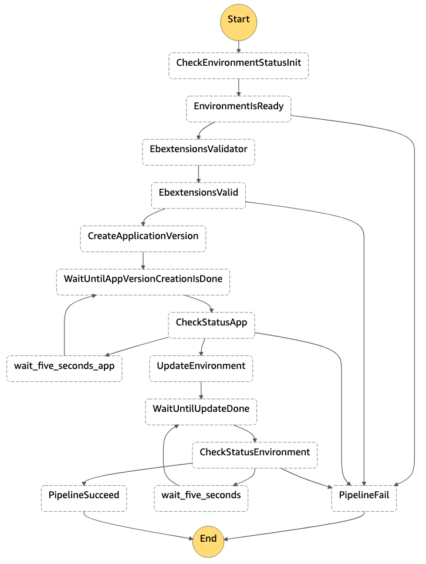

# application_deployment

This folder contains the CloudFormation template `application_deployment.yaml` and Python code for Lambda functions. The template contains the StateMachine which is used to deploy and update the Application code.  
You also find unit-tests in this folder for the *ebextensions_validator* Python code.

## State Machine

In the following you see the flow representation of the StateMachine deployed by `application_deployment.yaml`

**CheckEnvironmentStatusInit, CheckStatusApp, CheckStatusEnvironment**  
These tasks perform read-only API calls to the AWS Elastic Beanstalk API to check, if the Elastic Beanstalk environment is ready to receive an update.

**EbextensiosValidator**  
This task downloads the application zip archive and the Allowlist from the *ebextensions-validator-allowlist* S3 bucket. By leveraging the ***ebextensions-validator* Python library**, the Lambda performs a validation if the **.ebextensions** configuration are considered as compliant. Based on that, the workflow either continues or breaks.  
The Lambda function also contains a simple check if the **env.yaml** file is present in the root directory of the application. If yes, the workflow also breaks. If a more sophisticated logic for validating env.yaml is needed, it needs to be developed.  
You find more information about the ***ebextensions-validator* Python library** in [ebextensions-validator](../../ebextensions-validator).  

**CreateApplicationVersion, UpdateEnvironment**  
The **CreateApplicationVersion** task performs a write API calls the AWS Elastic Beanstalk API to create a new application version by using the application provided within the parameters of the StateMachine execution call. The new application version is then deployed in the **UpdateEnvironment** step.
